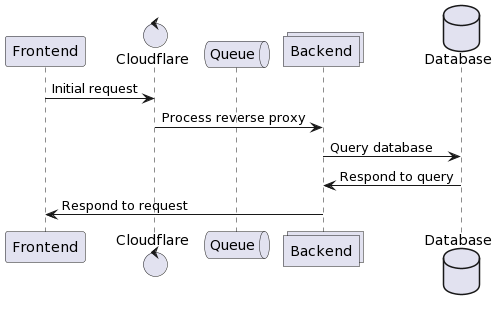
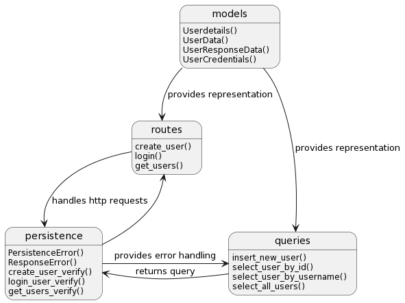
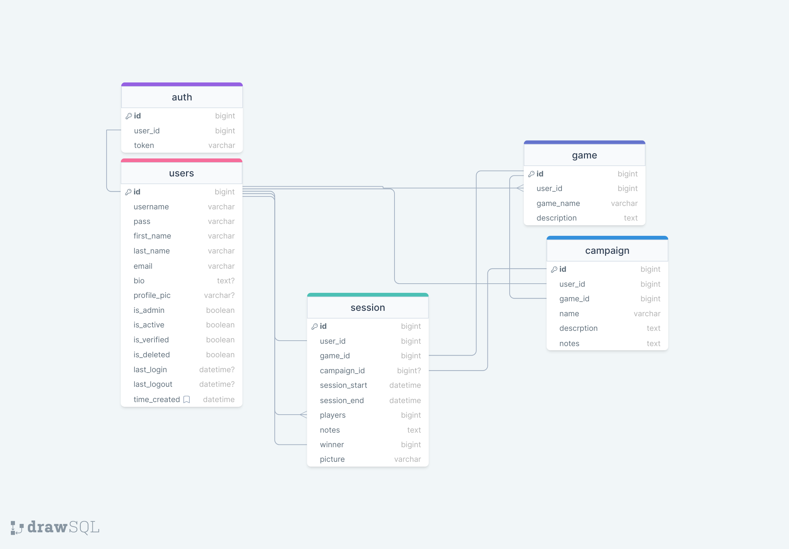

# Stratego Architecture
Allowing users to signup or login to the app has been essential to other parts of the app. 
As seen below Login or Signup requests begin as HTTP requests sent through DDoS protection, and is handled by a reverse proxy.
The reverse proxy performs load balancing by creating backend instances to handle demand. Backend instances convert HTTP requests to mySQL queries and respond to the initial request.
Backend Instances can be created and terminated as needed.

In the backend representation below, the models class is used by multiple classes for authentication and account info.
Translating HTTP requests are by the routes class into mySQL. The persistence class performs error handling for these requests. 
The Query class performs the querying and returns any results back to the controller.

A simple schema for our databases can be seen below. In addition to the models for authentication and account info, session,campaign and game models will be used for future features.
Database services such as Planet side can be used to reduce completion time and improve reliability.

