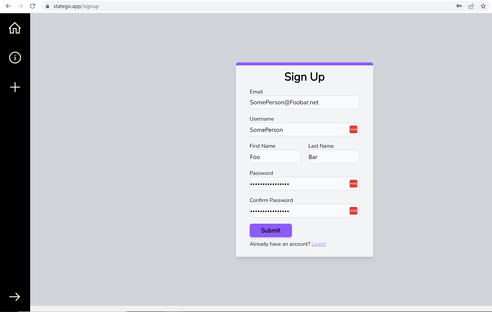
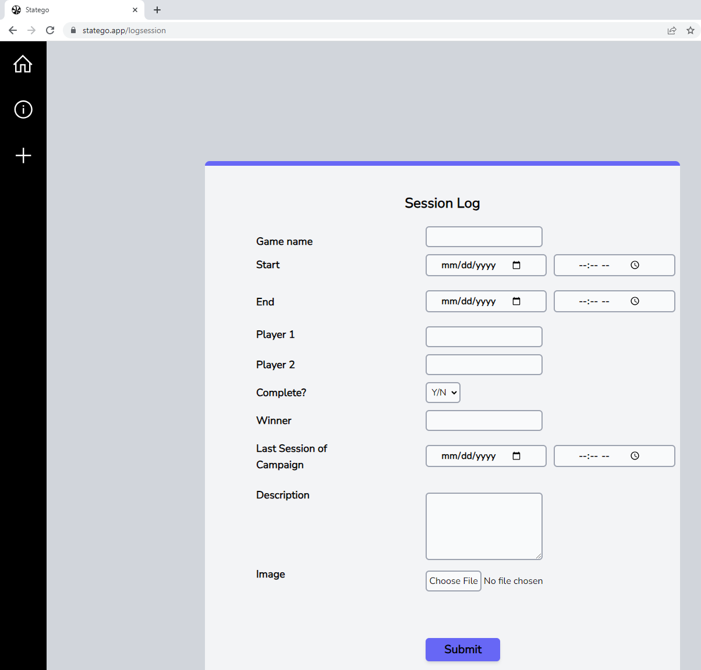

# Sprint 3 Ceremony Minutes
  
Date: 2023-10-21

Members present:

* Zachary Nelson
* John Brown
* Tyler Popson
* Mason Napper
  
## Demo

This sprint, we completed:

* A change to site navigation by adding a sidebar.
* A redesign of the session log. 
* A bugfix for an overflow bug when submitting a session log on Firefox.

Here are screenshots of what we did:

## Retro

[What is a Sprint Retrospective](https://www.scrum.org/resources/what-is-a-sprint-retrospective)

### Larian(Good)
* Consistent communication
* Backend change for easier compiling.
* Better understanding of frameworks used.

### EA(Bad)

* Lack of individual method tests.
* Productivity issues during midterms.
* Lack of consistent workload towards end of features. 
* Backend switch consumed productivity.

### Bethesda(Actionable Commitments)

* As a team we'll implement more unit testing.
* As a team well implement more integration testing.
* As a team we'll define actionable, reasonable tasks.
* As a team we'll deploy the backend.
* As a team we'll integrate the frontend and backend.

## Planning

(This section can and should be completed in your GitHub projects, but please summarize here)

| Points | Story                                                           |
|--------|-----------------------------------------------------------------|
| 3      | As a user, I want a landing page.                               |
| 5      | As a user, I want a user dashboard.                             |
| 5      | As an admin, I want an admin dashboard.                         |
| 3      | As a user, I want an about page.                                |
| 8      | As a user, I want to be authenticated while accessing features. |

