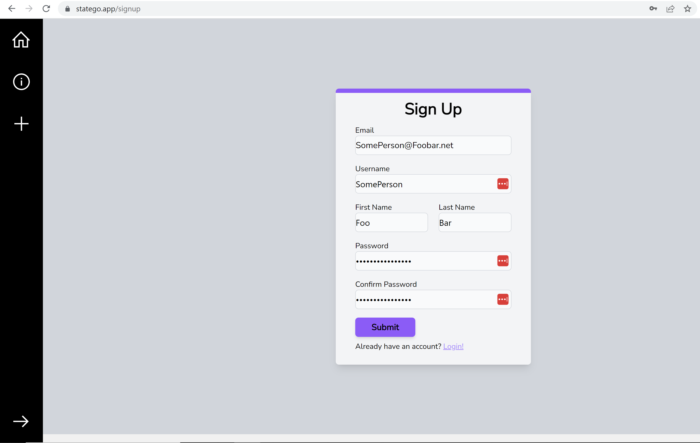
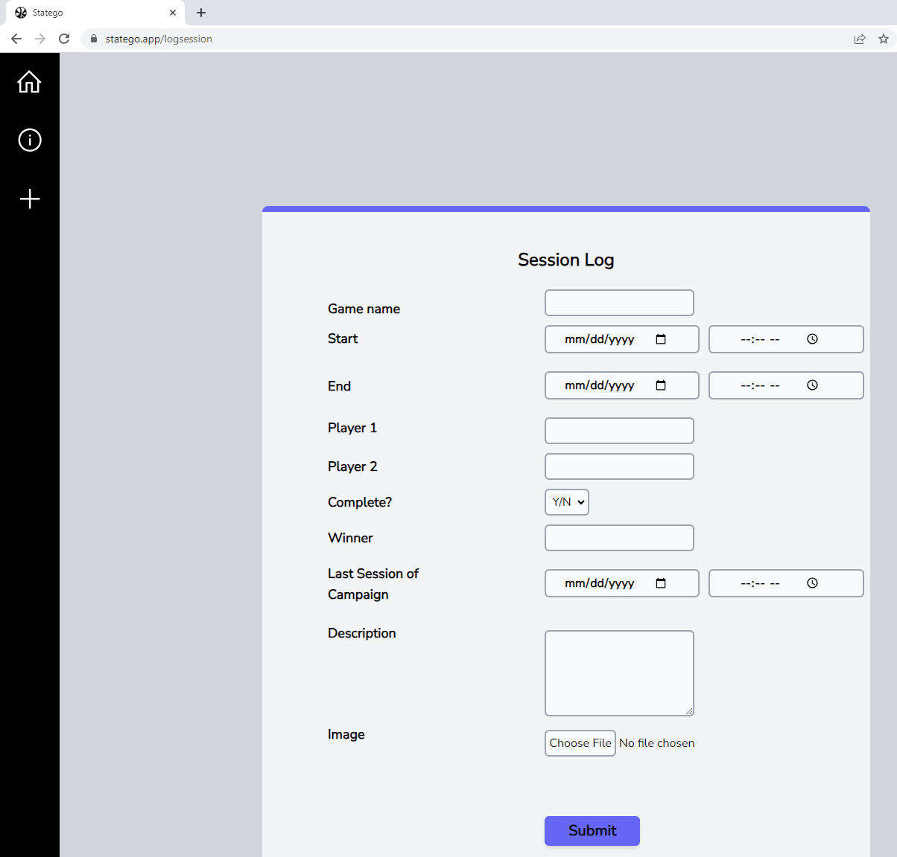

# Sprint 4 Ceremony Minutes
  
Date: 2023-11-2

Members present:

* Zachary Nelson
* John Brown
* Tyler Popson
* Mason Napper
  
## Demo

This sprint, we completed:

* New backend endpoints for querying users.
* A backend endpoint for creating a session.
* A suite of tests for the backend endpoints. 
* A published project reflections file.

Here are screenshots of what we did:

## Retro

[What is a Sprint Retrospective](https://www.scrum.org/resources/what-is-a-sprint-retrospective)

### Firefox(Good)
* Responsiveness and clear communication.
* Steady progress on features.
* Re-prioritizing features to work on for sprints.
* Fixing of issues in multiple browsers, bug fixes.

### Edge(Bad)

* Complexity of authentication brings down productivity.
* Authentication features taking too much time/ resources.
* Lack of complete backend testing.
* Backend and UI design consuming too much time.

### Safari(Actionable Commitments)

* As a team we'll reevaluate stories for a sprint for completion.
* * As a team well implement more individual unit testing.
* As a team well implement more integration testing.

## Planning

(This section can and should be completed in your GitHub projects, but please summarize here)

| Points | Story                                                            |
|--------|------------------------------------------------------------------|
| 5      | As a user, I want a logged session after choosing log a session. |
| 2      | As a user, I want a logged game after choosing entering a game.  |
| 3      | As a user, I want a logged campaign after logging a campaign.    |
| 5      | As a user, I want an about page to learn about the app.          |
| 5      | As an admin, I want to ensure all features work together.        |

