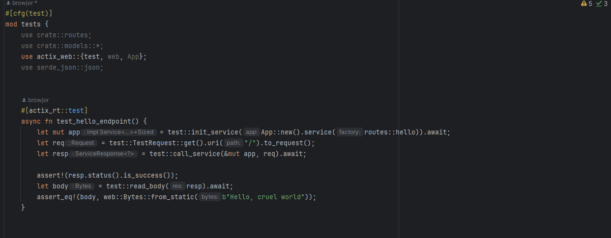

# Sprint 5 Ceremony Minutes

Date: 2023-11-21

Members present:

* Zachary Nelson
* John Brown
* Tyler Popson
* Mason Napper

## Demo

This sprint, we completed:

* Updating testing.md with new tests.
* Created a user dashboard.
* Created an endpoint for deleting a session record from the database.
* 

Here are screenshots of what we did:

## Retro

[What is a Sprint Retrospective](https://www.scrum.org/resources/what-is-a-sprint-retrospective)

### Dune(Good)
* Integration testing using a live database.
* Features requiring endpoints are more defined. 
* Working with each-other to get past roadblocks.

### TwilightImperium(Bad)

* Authentication complexity preventing other features.
* Final deadline pressure.
* Growing complexity of infrastructure.

### Everdell(Actionable)

* As a team we'll reevaluate the features we want for the final sprint.
* As a team, we may want to implement manual authentication.
* As a team, well finish the features for the user process. 

## Planning

(This section can and should be completed in your GitHub projects, but please summarize here)

| Points | Story                                                   |
|--------|---------------------------------------------------------|
| 1      | As a user, I want to delete a session.                  |
| 3      | As a user, I want to delete a game.                     |
| 2      | As a user, I want to delete a campaign.                 |
| 3      | As a user, I want to delete my account                  |
| 5      | As a user, I want a dashboard to access other features. |
| 3      | As a user, I want a page for campaigns.                 |

